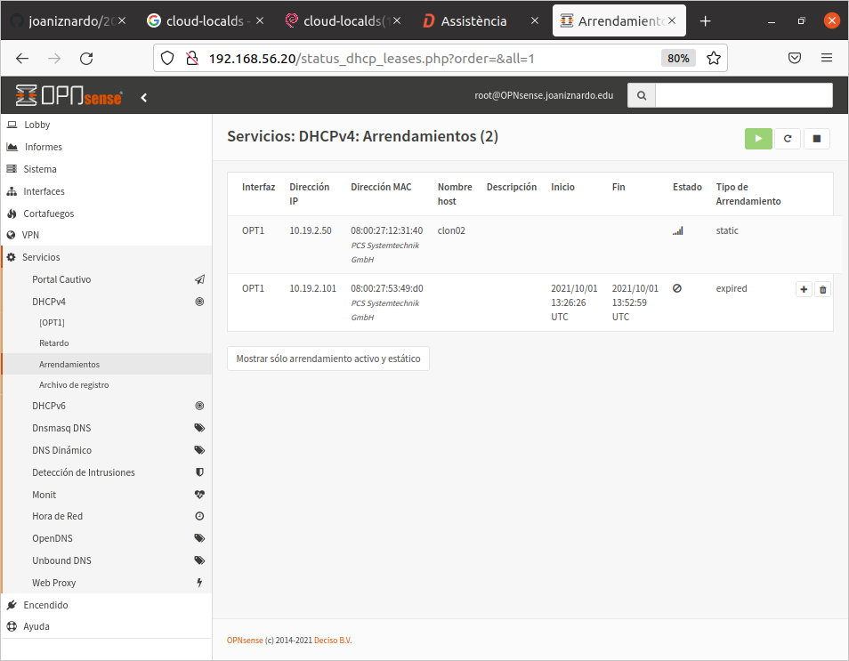

# Repte 03 - Ampliem el servidor dhcp (opensense i ubuntu server)

Objectiu: El servidor de ubuntu rep una ip FIXA per part del servidor de dhcp d'Opnsense. (ip de xarxa: 10.7.x.0/24)

Restriccions:  
- no se pot fer servir el mode bridge a virtualbox  
- totes dues vms poden navegar per internet (Mode NAT)
- la connexió entre totes dues màquines virtuals se farà amb xarxa interna  
- la vm d'opnsense necessitarà d'una tercera interfície (xarxa) addicional.  
- opnsense  quedarà amb:
  - LAN (host only)  
  - WAN (NAT)  
  - GUEST (internal)
- ubuntu server quedarà amb:
  - WAN (NAT)
  - GUEST (internal)

Hauria de quedar-te com   

LLiurar les catures [aqui](http://tiny.cc/n22kuz)  
