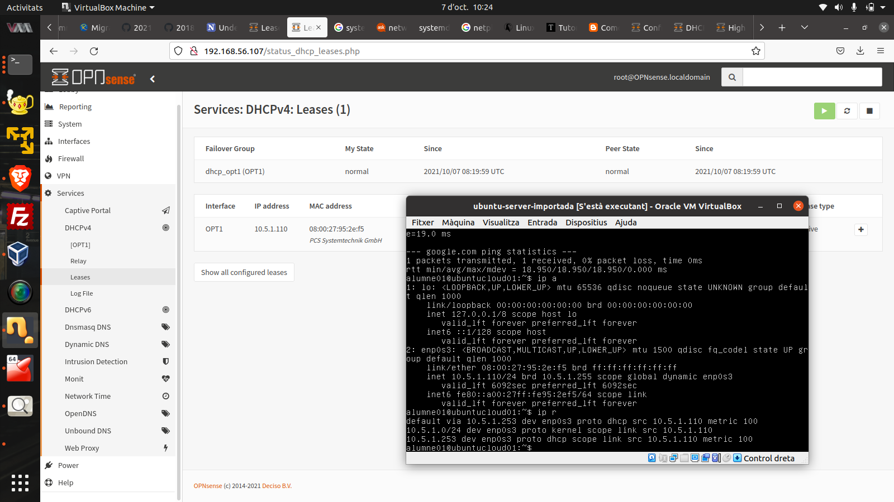
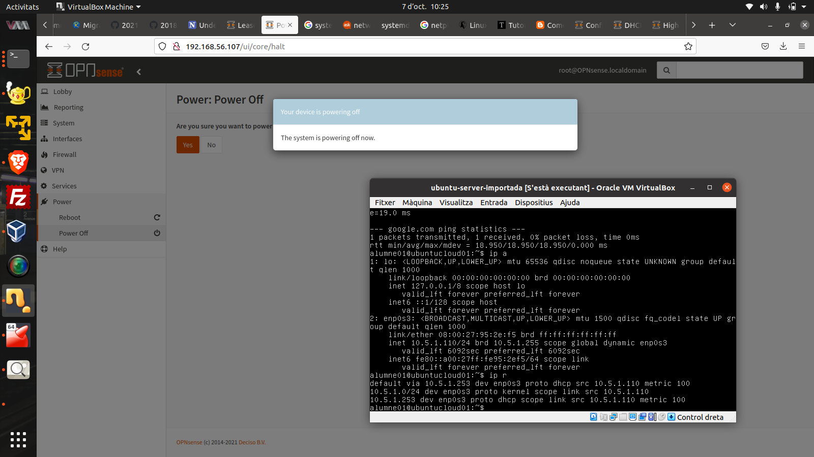
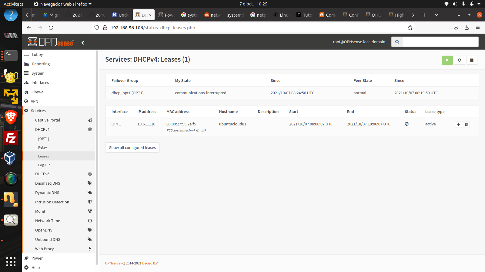
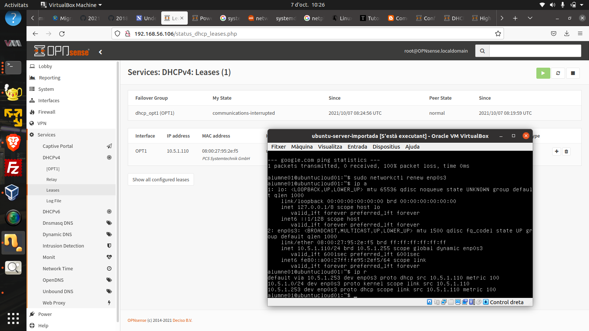

# Repte 05 - Redundància coordinada - 2 servidors dhcp (2 x opnsense i un client (ubuntu server))  
Objectiu: Clona (linked clone) el servidor opnsense i fes que el client reba una ip sempre que hi hagi un opnsense actiu. (ip de xarxa: 10.7.x.0/24)  

Pista: cal activar el mode alta disponibilitat.  

Restriccions:  
- la ip de interfície de la xarxa GUEST dels Opnsense és diferent (sinó tindríem un problema)  
- els servidors reparteixen el mateix rang d'ips (unes 30 per exemple)  
- no se pot fer servir el mode bridge a virtualbox  
- **SOLS OPNSENSE** pot navegar per internet directament (Mode NAT)  
- la connexió entre totes dues màquines virtuals se farà amb **xarxa interna**  
- la vm d'opnsense necessitarà d'una tercera interfície (xarxa) addicional.  
- opnsense  quedarà amb:  
  - LAN (host only)  
  - WAN (NAT)  
  - GUEST (internal)  
- ubuntu server quedarà amb:  
  - GUEST (internal)  

Caldrà demostrar amb captures de pantalla que el client rep ips dels 2 servidors (desactivar un cada cop).   

